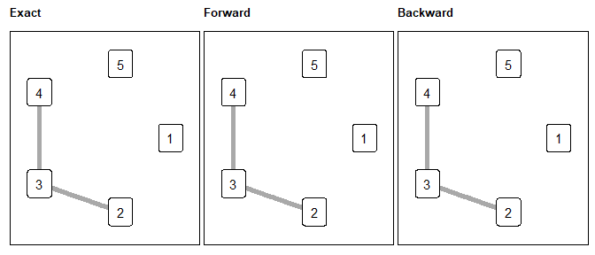

<!-- README.md is generated from README.Rmd. Please edit that file -->

# MixingGraph: estimation for graphical models under mixing conditions

<!-- badges: start -->


<!-- badges: end -->

The goal of MixingGraph is to implement a novel approach for estimating
the graph of conditional dependencies in a random vector based on finite
sample data. We define this approach as a global model selection
criterion, which means optimizing a function across the entire set of
potential graphs, removing the need to estimate and combine individual
neighborhoods as commonly proposed in the literature. To the best of our
knowledge, these results represent a pioneering demonstration of the
consistency of a model selection criterion for Markov random fields on
graphs when dealing with non-independent data.

## :writing_hand: Author

Magno T. F. Severino <https://magnotairone.github.io/>

## :arrow_double_down: Installation

You can install the development version of MixingGraph from
[GitHub](https://github.com/) with:

``` r
# install.packages("devtools")
devtools::install_github("magnotairone/MixingGraph")
```

## Example

This is a basic example which shows you how to run the algorithms using
an example in the `sample_data` dataframe:

``` r
library(MixingGraph)
data(sample_data)
```

**Exact algorithm:**

``` r
res_exact <- exact(sample_data, card_A = 2, d = ncol(sample_data), lambda = 1 * log(nrow(sample_data)))
res_exact$G_hat # estimated graph
#> [[1]]
#>      [,1] [,2] [,3] [,4] [,5]
#> [1,]    0    0    0    0    0
#> [2,]    0    0    1    0    0
#> [3,]    0    1    0    1    0
#> [4,]    0    0    1    0    0
#> [5,]    0    0    0    0    0
res_exact$logLG_hat # penalized log pseudo-likelihood
#> [1] -3192.653
```

**Forward stepwise algorithm:**

``` r
res_fwd <- greedy_forward(sample_data, lambda = 1 * log(nrow(sample_data)), card_A = 2, d = ncol(sample_data))
res_fwd$G_hat # estimated graph
#> [[1]]
#>      [,1] [,2] [,3] [,4] [,5]
#> [1,]    0    0    0    0    0
#> [2,]    0    0    1    0    0
#> [3,]    0    1    0    1    0
#> [4,]    0    0    1    0    0
#> [5,]    0    0    0    0    0
res_fwd$logLG_hat # penalized log pseudo-likelihood
#> [1] -3192.653
```

**Backward stepwise algorithm:**

``` r
res_bcw <- greedy_forward(sample_data, lambda = 1 * log(nrow(sample_data)), card_A = 2, d = ncol(sample_data))
res_bcw$G_hat # estimated graph
#> [[1]]
#>      [,1] [,2] [,3] [,4] [,5]
#> [1,]    0    0    0    0    0
#> [2,]    0    0    1    0    0
#> [3,]    0    1    0    1    0
#> [4,]    0    0    1    0    0
#> [5,]    0    0    0    0    0
res_bcw$logLG_hat # penalized log pseudo-likelihood
#> [1] -3192.653
```

**Plotting the result:**

``` r
coords <- generate_circular_node_positions(5, 5) # package helper function to generate coordinate for the vertices

g_exact <- plot_graph_from_matrix(res_exact$G_hat[[1]], coords, title = "Exact")
g_fwd <- plot_graph_from_matrix(res_fwd$G_hat[[1]], coords, title = "Forward")
g_bcw <- plot_graph_from_matrix(res_bcw$G_hat[[1]], coords, title = "Backward")

library(patchwork)
g_exact + g_fwd + g_bcw
```


